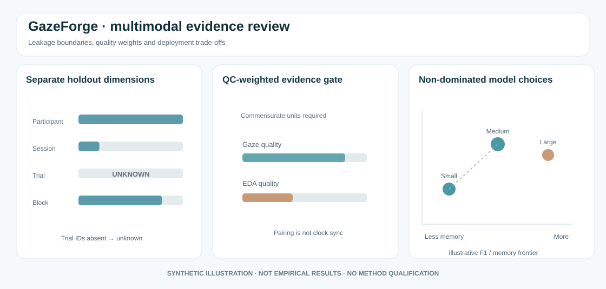

# Multimodal evidence graphics: integrity before prediction



*Original schematic with synthetic illustrative values; not a validated dataset, actual device measurement, clinical interpretation, or trained-model benchmark.*

## Plot 1. Independent split dimensions must not collapse into one flag

A participant-disjoint test set, session-disjoint test set, trial-disjoint set and temporally separated test block make **different claims**. One axis can pass while another fails. If trial identifiers do not exist, report the trial-separation assessment as **unknown**, not successful.

The experimental [GazeForge multimodal integrity PR #249](https://github.com/stefanosbalaskas/GazeForge/pull/249) records participant, session, temporal-block and trial overlaps independently. Naming blocks does not guarantee temporal independence; adjacency, video source, preprocessing and event overlap still require an explicit audit.

## Plot 2. Quality-weighted fusion is not automatic calibration

A QC-weighted mean can be reported only when the caller has already shown that channels are aligned and that their measurement scales are comparable. For example, an eye-gaze spatial coordinate and a raw electrodermal conductance value cannot be simply averaged because both happen to be finite.

```python
import numpy as np

# Illustrative normalized measurements on a deliberately shared scale.
values = np.array([.2, .7])
weights = np.array([.85, .35])  # declared external quality scores
weighted_mean = np.dot(values, weights) / weights.sum()
print(round(float(weighted_mean), 4))
```

This calculation is a mathematical illustration; it is **not** a learned multimodal model, sensor-quality classifier, synchronized timestamp proof, or clinical stress score.

## Plot 3. Compare model performance only against comparable hardware evidence

A resource-performance Pareto view should distinguish models that are dominated by alternatives, while retaining **all** nondominated candidates rather than automatically selecting a model.

```python
import pandas as pd

# Synthetic, within-one-dataset, within-one-holdout illustrative benchmark.
benchmarks = pd.DataFrame({
    "model": ["small", "medium", "large"],
    "macro_f1": [.75, .82, .81],
    "memory_mb": [5.0, 9.0, 10.0],
    "latency_ms": [4.0, 9.0, 12.0],
    "energy_mj": [.05, .09, .12],
})
print(benchmarks)
```

Under these constructed values, both small and medium models are nondominated, while large is dominated by medium. Do not mix `analytical_estimate` resource values with `hardware_measured` results on the same asserted Pareto frontier, or mix participant-disjoint and segment-random performance claims without explicitly stratifying evidence.

## What remains before a scientific claim?

- Verified person, trial, session, block, and physical clock-alignment information;
- Real or externally benchmarked quality labels and modality ablations;
- Evaluation on genuinely held-out participants, with confidence intervals;
- Sensor/model/construct calibration and hardware resource evidence.

The new research helpers remain **draft experimental** in [PR #249](https://github.com/stefanosbalaskas/GazeForge/pull/249). This gallery is an educational graphic, not an announcement of validation or release.
