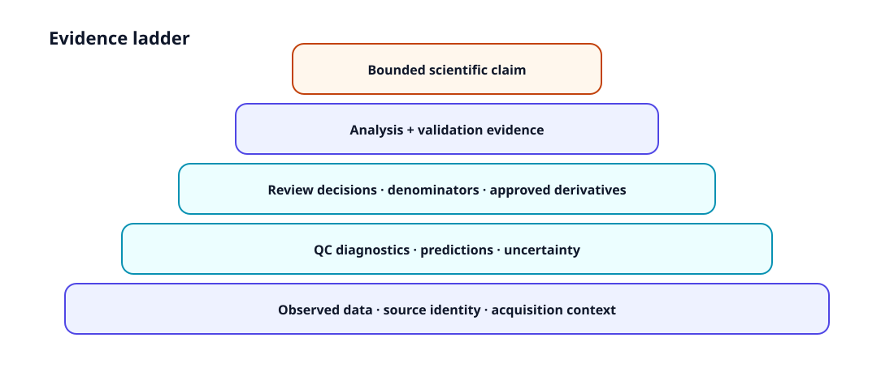

---
tags:
  - Articles
  - QC
  - Missing data
  - Reporting
---

# QC flags are not exclusions

A quality-control procedure can detect unusual or potentially problematic observations. That does **not** make the procedure an automatic deletion rule.

## Three different objects

1. **Observed data** — what was recorded.
2. **QC evidence** — diagnostics, flags, scores, and warnings derived from those observations.
3. **Review/exclusion decisions** — explicit decisions about whether an observation contributes to a defined analysis.

Collapsing these objects makes it difficult to reconstruct why denominators changed.

## What should remain visible

A defensible QC workflow records the diagnostic, threshold or rule, affected unit, review status, final decision, rationale, and denominator effect.

## Why this matters statistically

Exclusion can alter group composition, exposure, event counts, dwell denominators, latency risk sets, and missing-data patterns. A rule applied after inspecting the result can also change the interpretation of uncertainty.

## GazeForge rule

QC functions should produce **evidence for review**. They should not silently mutate the source table into a preferred analysis sample.

## Continue

- [Synthetic QC tutorial](../tutorial-synthetic-qc.md)
- [QC review & exclusion ledger](../qc-review-exclusion-ledger.md)
- [Denominator, exposure & censoring](../denominator-exposure-censoring.md)
- [Missing-data assumptions](../missing-data-assumptions.md)
