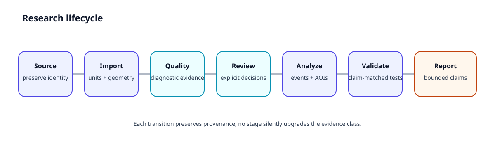

---
tags:
  - Guide
  - Workflow
  - Examples
  - Visualization
---

# Explore GazeForge

GazeForge has detailed scientific reference material, but researchers normally arrive with a **task**, not a module name. This page is the shortest route into the documentation.

<a class="gf-explore-card" href="../articles/"><strong>Understand a methodological decision</strong>Read compact articles about QC, missingness, AI assistance, validation design, and evidence boundaries.</a>

<a class="gf-explore-card" href="../examples-gallery/"><strong>Run something</strong>Choose from the repository's 22 Python workflows and continue into the matching methodological guide.</a>

<a class="gf-explore-card" href="../plot-gallery/"><strong>See the output</strong>Browse diagnostics, scanpaths, benchmark plots, and methodological diagrams with interpretation limits beside them.</a>

<a class="gf-explore-card" href="../workflow-gallery/"><strong>Follow a complete workflow</strong>Move from source identity through QC, review, events, AOIs, analysis handoff, validation, and reporting.</a>

<a class="gf-explore-card" href="../guides/"><strong>Solve a specific problem</strong>Task-oriented guides connect research questions to methods, examples, outputs, limitations, and APIs.</a>

<a class="gf-explore-card" href="../api-reference/"><strong>Look up an API</strong>Drop into exact interfaces after the scientific assumptions and evidence boundary are clear.</a>

## Core research lifecycle

The workflow is deliberately staged. **Import compatibility is not measurement validity; QC evidence is not an exclusion decision; a learned prediction is not ground truth; reproducibility is not external validity.**

## Recommended first routes

| Your situation | Start here | Continue to |
| --- | --- | --- |
| New to GazeForge | [GazeForge tour](gazeforge-tour.md) | [First study blueprint](first-study-blueprint.md) |
| Real tracker export | [Worked tracker import](worked-tracker-import.md) | [QC review ledger](qc-review-exclusion-ledger.md) |
| Event detection | [I-VT tutorial](tutorial-ivt-baseline.md) | [Event-model validation](event-model-validation-clinic.md) |
| Moving stimulus | [Worked dynamic-AOI study](worked-dynamic-aoi-study.md) | [Dynamic AOI evaluation](dynamic-aoi-evaluation.md) |
| Statistical handoff | [Analysis handoff](analysis-handoff.md) | [Grouping/repeated measures](grouping-repeated-measures.md) |
| Manuscript preparation | [Reporting clinic](reporting-clinic.md) | [Publication readiness](publication-readiness.md) |
| Validation claim | [Validation guide](validation-evidence-guide.md) | [Evidence status](evidence-status.md) |
