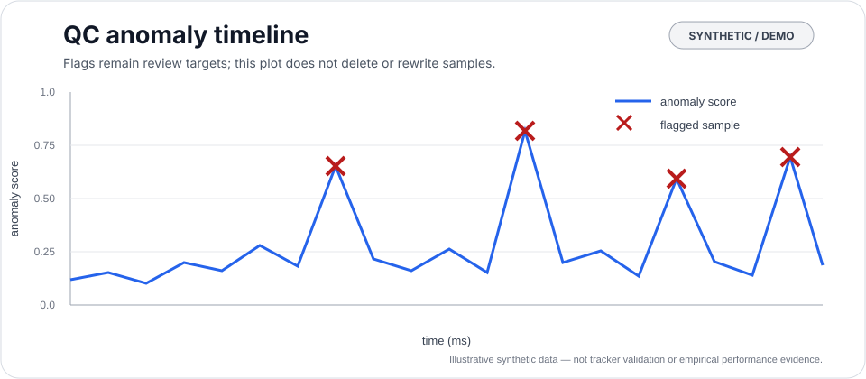
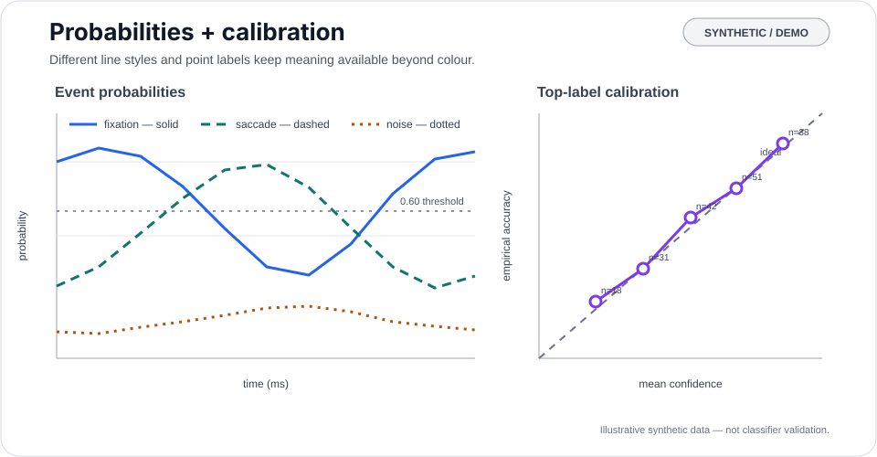
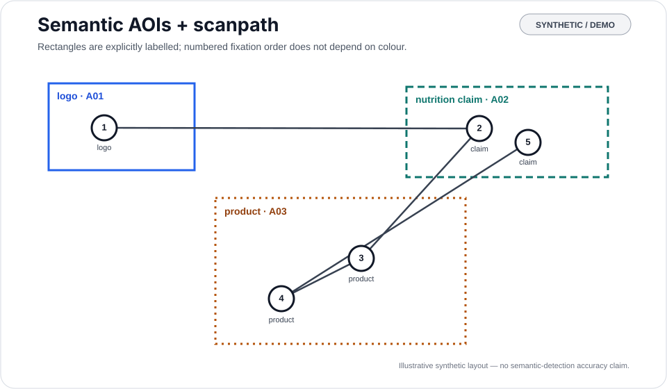
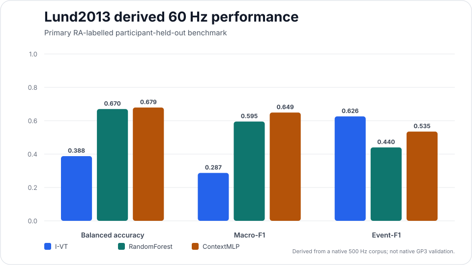

---
hide:
  - navigation
  - toc
---

<div class="gf-hero" markdown>


<span class="gf-hero-kicker">Python Suite research package</span>

# GazeForge

## Auditable AI for eye-tracking research

Machine learning, computer vision, temporal event modelling, semantic AOIs, scanpaths, validation, and provenance — designed so AI can assist eye-tracking research **without silently rewriting the empirical record**.

<div class="gf-hero-actions" markdown>

[Take the tour](gazeforge-tour.md){ .md-button .md-button--primary }
[Choose a task](documentation-map.md){ .md-button }
[Inspect evidence](validation-evidence-guide.md){ .md-button }

</div>

<div class="gf-resource-rail" markdown>

[Install](release-install.md) · [Task map](documentation-map.md) · [Troubleshooting](troubleshooting.md) · [PyPI](https://pypi.org/project/gazeforge/) · [Citation & attribution](citation-attribution.md) · [DOI](https://doi.org/10.5281/zenodo.22650013) · [Gazepoint / GP3](gazepoint-gp3.md) · [GitHub](https://github.com/stefanosbalaskas/GazeForge)

</div>

</div>

<nav class="gf-help gf-help-home" aria-label="GazeForge help">
<a href="gazeforge-tour.md">Tour</a>
<a href="documentation-map.md">Task map</a>
<a href="troubleshooting.md">Troubleshooting</a>
<a href="runnable-examples.md">Examples</a>
<a href="https://github.com/stefanosbalaskas/GazeForge/issues">Ask / report</a>
</nav>

<div class="gf-contract" markdown>

### The scientific contract

> **AI may propose, score, classify, embed, or flag. It must not silently alter the empirical record.**

GazeForge keeps predictions, confidence, model identity, sampling-rate assumptions, review decisions, and benchmark provenance visible as ordinary research data.

</div>

<div class="gf-status-strip">
  <div class="gf-status-card">
    <span class="gf-status-kicker">Release</span>
    <strong>0.1.0a1</strong>
    <span>Public alpha on PyPI and Zenodo.</span>
  </div>
  <div class="gf-status-card">
    <span class="gf-status-kicker">Evidence status</span>
    <strong>Generated &amp; fail-closed</strong>
    <span>Lund2013, Hollywood2EM, Gaze-in-the-Wild, bounded VISUS evidence, and native-device gaps are rendered from versioned evidence policy.</span>
  </div>
  <div class="gf-status-card">
    <span class="gf-status-kicker">Native 60 Hz / GP3</span>
    <strong>Evidence gate open</strong>
    <span>An expert-labelled native corpus is still required for device-specific event validity.</span>
  </div>
  <div class="gf-status-card">
    <span class="gf-status-kicker">CI matrix</span>
    <strong>3 Python × 3 OS</strong>
    <span>Python 3.10, 3.12, and 3.14 on Linux, macOS, and Windows.</span>
  </div>
</div>

## Start safely with research data

<div class="gf-onboarding-grid" data-research-onboarding-path>

<a class="gf-route-card" data-onboarding-step="understand" href="gazeforge-tour/">
<span class="gf-route-label">1 · Understand</span>
<h3>See what GazeForge actually does</h3>
<p>Run one deterministic source → QC → events → AOIs → scanpaths → provenance workflow before choosing a specialist method.</p>
</a>

<a class="gf-route-card" data-onboarding-step="import" href="worked-tracker-import/">
<span class="gf-route-label">2 · Import</span>
<h3>Bring a tracker export in without guessing</h3>
<p>Freeze participant/trial identity, timestamp units, coordinate basis, geometry, nominal rate, observed cadence, duplicates, and source fingerprints.</p>
</a>

<a class="gf-route-card" data-onboarding-step="review" href="qc-review-exclusion-ledger/">
<span class="gf-route-label">3 · Review</span>
<h3>Separate QC evidence from exclusions</h3>
<p>Keep flags, human review, denominators, prespecified criteria, exploratory sensitivity rules, and the primary-analysis derivative distinct.</p>
</a>

<a class="gf-route-card" data-onboarding-step="analyze" href="method-chooser/">
<span class="gf-route-label">4 · Analyze</span>
<h3>Choose the method that matches the research task</h3>
<p>Route to transparent events, learned-model validation, static/dynamic AOIs, scanpaths, study freeze, reporting, or empirical-evidence review.</p>
</a>

</div>

<div class="gf-decision">
<strong>Do not collapse the stages.</strong> A parsed export is not a validated measurement, a QC flag is not an exclusion, a learned prediction is not ground truth, and a reproducible workflow is not evidence of external validity.
</div>

## The GazeForge research path

<div class="gf-flow" aria-label="Seven-stage GazeForge research journey">
<div><strong>01</strong><span>Source</span><small>Preserve the original export and acquisition identity.</small></div>
<div><strong>02</strong><span>Import</span><small>Make units, geometry, grouping, cadence, and transformations explicit.</small></div>
<div><strong>03</strong><span>Quality</span><small>Add non-destructive diagnostics and trial-quality evidence.</small></div>
<div><strong>04</strong><span>Review</span><small>Record retained/excluded decisions and denominators separately.</small></div>
<div><strong>05</strong><span>Analyze</span><small>Derive events, AOIs, assignments, scanpaths, and study structures.</small></div>
<div><strong>06</strong><span>Validate</span><small>Match held-out units, metrics, calibration, and evidence class to the claim.</small></div>
<div><strong>07</strong><span>Report</span><small>Freeze identity, then translate artifacts into claim-safe Methods, Results, captions, and archive records.</small></div>
</div>

## Start from your task

<div class="gf-task-grid" markdown>

<div class="gf-task-card" markdown>

<span class="gf-task-kicker">Do the work</span>

### :material-rocket-launch-outline: Run a workflow

Follow one executable path from source gaze through canonicalisation, QC, transparent events, AOIs, scanpaths, provenance, and reviewable exports.

[Open the practical workflow →](practical-workflow.md)

</div>

<div class="gf-task-card" markdown>

<span class="gf-task-kicker">Understand the methods</span>

### :material-flask-outline: Choose a method

Match the scientific question, available evidence, grouping/generalisation unit, validation requirement, and intended claim before dropping into API details.

[Open the method chooser →](method-chooser.md)

</div>

<div class="gf-task-card" markdown>

<span class="gf-task-kicker">Check the claims</span>

### :material-shield-search-outline: Inspect evidence

Start with the generated evidence layer, then drill into the benchmark whose provenance, labels, sampling rate, and split design match your question.

[Open the validation guide →](validation-evidence-guide.md)

</div>

</div>

<div class="gf-support-links" markdown>

**New here?** [Start with the GazeForge Tour](gazeforge-tour.md) · [Follow a first study](first-study-blueprint.md) · [Freeze outcomes & estimands](estimand-preregistration.md) · [Choose from the Documentation Map](documentation-map.md) · [Choose a method](method-chooser.md) · [Understand outputs](artifact-dictionary.md) · [Build an evidence bundle](research-evidence-bundle.md) · [Audit what a gaze measure supports](measurement-interpretation.md) · [Audit denominators & exposure](denominator-exposure-censoring.md) · [Document missing-data assumptions](missing-data-assumptions.md) · [Audit model diagnostics](model-diagnostics-convergence.md) · [Audit uncertainty & multiplicity](inferential-reporting-audit.md) · [Audit sensitivity & robustness](sensitivity-robustness-clinic.md) · [Report without overclaiming](reporting-clinic.md) · [Share with a reviewer](reviewer-replication-handoff.md) · [Troubleshoot a workflow](troubleshooting.md) · **Also useful:** [Research recipes](research-recipes.md) · [Import real data](data-import-clinic.md) · [Worked tracker import/QC](worked-tracker-import.md) · [Review QC & exclusions](qc-review-exclusion-ledger.md) · [Validate event models](event-model-validation-clinic.md) · [Study lifecycle](study-lifecycle.md) · [Study-design templates](study-design-templates.md) · [Worked dynamic-AOI study](worked-dynamic-aoi-study.md) · [Methods overview](methods-overview.md) · [Runnable examples](runnable-examples.md) · [Validation reporting](validation-reporting-cookbook.md) · [Research terminology](research-terminology.md) · [Benchmark guide](benchmark-guide.md) · [Reproducible reporting](reproducible-reporting.md)

</div>

## From research question to publication

<div class="gf-task-grid" markdown>

<div class="gf-task-card" markdown>

<span class="gf-task-kicker">Plan the study</span>

### :material-map-marker-path: Follow the study lifecycle

Move from an observable research construct through acquisition, import, QC, events, AOIs, scanpaths, validation, provenance, analysis freeze, and reporting.

[Open the study lifecycle →](study-lifecycle.md)

</div>

<div class="gf-task-card" markdown>

<span class="gf-task-kicker">Learn by example</span>

### :material-bullhorn-outline: Run a worked study

Use a deterministic static advertising/interface demonstration with explicit `brand`, `claim`, `disclosure`, and `product` AOIs, reviewable outputs, and source fingerprints.

[Open the worked study →](worked-advertising-study.md)

</div>


<div class="gf-task-card" markdown>

<span class="gf-task-kicker">Prepare model inputs</span>

### :material-table-eye: Reconcile denominators & exposure

Keep observed zero, missing, absent-by-design, undefined denominators, partial
coverage, and right-censored no-fixation latency distinct before modelling.

[Open the denominator clinic →](denominator-exposure-censoring.md)

</div>


<div class="gf-task-card" markdown>

<span class="gf-task-kicker">Check fitted models</span>

### :material-stethoscope: Audit convergence & diagnostics

Treat non-convergence, singular/boundary states, separation or invalid covariance,
and missing diagnostics as explicit stop conditions before interpretation.

[Open the diagnostics clinic →](model-diagnostics-convergence.md)

</div>


<div class="gf-task-card" markdown>

<span class="gf-task-kicker">Check inferential reporting</span>

### :material-chart-error: Audit uncertainty & multiplicity

Keep effect scale, units, interval method/level, confirmatory-family membership,
and raw versus adjusted inferential fields explicit before manuscript wording.

[Open the inferential audit →](inferential-reporting-audit.md)

</div>

<div class="gf-task-card" markdown>

<span class="gf-task-kicker">Stress-test the analysis</span>

### :material-chart-bell-curve-cumulative: Audit sensitivity & robustness

Reconcile preregistered and executed variants, preserve denominator/exposure changes,
keep non-evaluable and non-converged cases visible, and separate changed-estimand
deviations from direct robustness comparisons.

[Open the sensitivity clinic →](sensitivity-robustness-clinic.md)

</div>

<div class="gf-task-card" markdown>

<span class="gf-task-kicker">Before submission</span>

### :material-clipboard-check-outline: Audit publication readiness

Check acquisition provenance, exclusions, model identity, split design, native/derived wording, evidence status, archive identity, and reproducible reporting before freezing manuscript claims.

[Open publication readiness →](publication-readiness.md)

</div>

<div class="gf-task-card" markdown>

<span class="gf-task-kicker">Freeze the archive</span>

### :material-archive-check-outline: Build the evidence bundle

Assemble source identity, pre-review QC, reviewed decisions, the primary-analysis derivative, event/AOI/scanpath outputs, provenance, fingerprints, and a human-readable archive map.

[Open the evidence-bundle guide →](research-evidence-bundle.md)

</div>


<div class="gf-task-card" markdown>

<span class="gf-task-kicker">Share the archive</span>

### :material-account-search-outline: Hand off to a reviewer or replicator

Map claims to artifacts and API routes, declare what can be rerun, record software
identity and access requirements, and carry limitations forward without treating
reproducibility as scientific validity.

[Open the reviewer handoff →](reviewer-replication-handoff.md)

</div>

</div>

<p class="gf-preview-note">The worked study uses synthetic/demo data only and does not establish consumer effects, empirical validation, native-device validity, native 60 Hz validity, Gazepoint validity, or GP3 validity.</p>

## See the workflow before you run it

The previews below use **synthetic/demo data only**. They illustrate software behaviour and review surfaces; they are **not empirical validation evidence** and do not establish native-device, native 60 Hz, Gazepoint, or GP3 validity.

<div class="gf-preview-grid">
  <a class="gf-preview-card" href="visual-diagnostics/">
    
    <span class="gf-preview-kicker">1 · Inspect quality</span>
    <strong>Non-destructive QC</strong>
    <span>Flag suspicious samples and review trial quality without silently deleting observations.</span>
  </a>
  <a class="gf-preview-card" href="event-model-validation-clinic/">
    
    <span class="gf-preview-kicker">2 · Validate predictions</span>
    <strong>Events &amp; calibration</strong>
    <span>Keep held-out identity, probabilities, sample/event metrics, calibration, and confidence/coverage visible.</span>
  </a>
  <a class="gf-preview-card" href="visual-diagnostics/">
    
    <span class="gf-preview-kicker">3 · Inspect meaning</span>
    <strong>AOIs &amp; scanpaths</strong>
    <span>Review semantic regions and sequence structure while preserving explicit labels and fixation order.</span>
  </a>
</div>

<p class="gf-preview-note">Synthetic/demo preview · not empirical validation evidence. <a href="visual-diagnostics/">Open all visual diagnostics →</a></p>

## What GazeForge covers

<div class="grid cards" markdown>

-   :material-eye-check-outline:{ .lg .middle } **Eye-event AI**

    ---

    Transparent I-VT and angular I-VT baselines, Random Forest classification, temporal-context MLPs, calibrated probabilities, confidence/coverage analysis, and event-level temporal matching.

    [Event-model validation clinic →](event-model-validation-clinic.md)

-   :material-vector-rectangle:{ .lg .middle } **Semantic AOIs**

    ---

    Human-defined and AI-proposed AOIs, optional OWL-ViT open-vocabulary detection, explicit review/correction, dynamic keyframes, bounded interpolation, and fixation assignment.

    [Dynamic AOIs →](dynamic-aois.md)

-   :material-chart-timeline-variant:{ .lg .middle } **Scanpaths & sequences**

    ---

    Semantic scanpaths, motifs, TF-IDF/SVD embeddings, similarity, and clustering without requiring an opaque generative model.

    [Research workflows →](research-workflows.md)

-   :material-shield-check-outline:{ .lg .middle } **Validation & provenance**

    ---

    Participant-held-out folds, leave-one-dataset-out validation, calibration, event-level metrics, evidence-aware dataset cards, fingerprints, and protected frozen reports.

    [Evidence status →](evidence-status.md)

</div>

## Public alpha release

**GazeForge 0.1.0a1** is the first public alpha release. It is available from [PyPI](https://pypi.org/project/gazeforge/0.1.0a1/) and archived on Zenodo with version DOI [`10.5281/zenodo.22650013`](https://doi.org/10.5281/zenodo.22650013). The release remains intentionally alpha: APIs may change while native 60 Hz/GP3-class validation, broader external benchmark qualification, and remaining dynamic-detection validation are completed.

[Release & install guidance →](release-install.md) · [Citation & attribution →](citation-attribution.md) · [Changelog & releases →](changelog.md)

## First frozen empirical checkpoint

GazeForge now contains its first reviewed external evidence suite from **Lund2013**, pinned to an exact upstream commit and verified file-by-file before analysis. The primary lower-rate analysis derives a 60 Hz human-reference condition from the native 500 Hz expert labels and evaluates all methods on identical participant-held-out folds.

<figure class="gf-figure-card">
  
  <figcaption>Primary RA-labelled participant-held-out checkpoint. The 60 Hz condition is derived from native 500 Hz data and is not native GP3 validation.</figcaption>
</figure>

| Model | Balanced accuracy | Macro-F1 | Event-F1 |
| --- | ---: | ---: | ---: |
| **I-VT** | 0.388 | 0.287 | **0.626** |
| **RandomForest** | 0.670 | 0.595 | 0.440 |
| **ContextMLP** | **0.679** | **0.649** | 0.535 |

The result is intentionally multi-criterion: **ContextMLP leads sample-level multiclass classification, while I-VT leads event segmentation and boundary fidelity.** The independent MN annotator sensitivity analysis reproduces that broad pattern. Human MN–RA agreement remains high from native 500 Hz (κ = 0.815) to derived 60 Hz (κ = 0.799).

!!! warning "Derived 60 Hz is not native GP3 validation"
    Lund2013 is a native 500 Hz corpus. These lower-rate results quantify a controlled derivation from expert annotations; they do not establish device-specific validity for a native 60 Hz Gazepoint GP3 recording. Native GP3-class expert-labelled event validation remains a major open evidence gate.

[Open the visual results gallery →](results-gallery.md) · [Inspect all verified Lund tables →](frozen-evidence.md) · [Read the generated evidence status →](evidence-status.md)

## A workflow designed for scientific review

```text
vendor / raw gaze
       │
       ▼
canonical gaze schema
       │
       ├── QC anomaly flags ────────────────┐
       ├── event probabilities ─────────────┤
       ├── semantic AOI proposals ─ review ─┤
       └── scanpath representations ────────┤
                                            ▼
                                  reviewed analytic table
                                            │
                                            ▼
                              model-ready statistical handoff
                                            │
                                            ▼
                               statistics / models / report
```

The package does **not** infer diagnoses, emotions, personality, protected traits, or unsupported latent mental states from gaze.

[Run the practical end-to-end workflow →](practical-workflow.md) · [Build model-ready tables →](analysis-handoff.md) · [Audit measurement interpretation →](measurement-interpretation.md) · [Report without overclaiming →](reporting-clinic.md) · [Choose a research workflow →](research-workflows.md)

## Validation is visible, not implied

The generated [Evidence status](evidence-status.md) page is the canonical public status layer. This summary uses the same status classes while retaining key benchmark-specific boundaries.

<div class="gf-status-grid" markdown>

| Benchmark | Human reference | Native rate | Current role |
| --- | --- | ---: | --- |
| **Lund2013** | paired expert event labels | 500 Hz | **Frozen empirical evidence**: native/derived human agreement, derived 60 Hz modelling, annotator and sampling/purity sensitivity |
| **Hollywood2EM** | sequential student labels with expert-corrected final labels | ≈500 Hz | **Frozen empirical evidence**: aggregate derived-60-Hz source-token-held-out evidence; token-disjoint only, not participant-disjoint; exact annotation-repository licence and token→participant mapping remain unresolved |
| **Gaze-in-the-Wild** | distributed trained human labellers | published 120 Hz acquisition; exact ProcessData nominal 300 Hz | **Reviewed empirical evidence**: exact-distribution participant-disjoint evidence on a derived 60-Hz task-agnostic grid; the complete authoritative numeric `TrIdx`→task mapping, task-stratified validation, native-60-Hz/GP3 validity, acquisition-hardware cadence verification, and quarantine exit remain open |
| **VISUS** | one published curated dynamic-AOI annotation process involving two contributors | 60 Hz | **Bounded empirical evidence**: verified partial public-derivative Tobii 60 Hz observations; the full 25-participant × 11-stimulus benchmark is not recovered, original source licensing remains unresolved, and no full-dataset model-validation, human-human-agreement, Frozen Evidence, or native-GP3 claim is created |

</div>

GazeForge never silently upgrades evidence strength. Resampled lower-rate evidence remains labelled as derived, human-human agreement is not treated as an error-free ceiling, and unresolved coordinate or identity evidence blocks stronger cross-dataset claims. For Gaze-in-the-Wild, the reviewed participant-disjoint benchmark remains task-agnostic: first-party task-separated extraction structure and secondary numeric corroboration do not substitute for a complete authoritative `TrIdx`→task mapping, and `TrIdx 4 → Tea_Making` is not inferred by elimination. Published 120 Hz acquisition provenance also remains distinct from the official 300 Hz processed-stream target and from the **actual analysis cadence from timestamps**, which is separately resolved before constructing the derived analysis grid. For VISUS, the current public derivative supports bounded empirical observations only; it does not recover the original full benchmark or establish model validity, independent human-human agreement, Frozen Evidence, unrestricted source redistribution, or native GP3 validity.

[Evidence status →](evidence-status.md) · [See the full validation matrix →](validation-status.md) · [Gaze-in-the-Wild task-mapping evidence →](gaze-in-wild-task-mapping-corroboration.md) · [VISUS public partial evidence →](visus-public-partial-evidence.md) · [See frozen empirical evidence →](frozen-evidence.md)

## Quick start

Install the exact public alpha from PyPI:

```bash
python -m pip install "gazeforge==0.1.0a1"
```

For development or commit-pinned research work:

```bash
git clone https://github.com/stefanosbalaskas/GazeForge.git
cd GazeForge
python -m pip install -e ".[dev]"
pytest
```

```python
from gazeforge import ai_flag_anomalies, canonicalize_gaze, simulate_gaze

raw = simulate_gaze(n_participants=3, n_trials=2, samples_per_trial=180)
gaze = canonicalize_gaze(raw, sampling_rate_hz=60)
flagged = ai_flag_anomalies(gaze.data, sampling_rate_hz=60)
```

[Take the GazeForge Tour →](gazeforge-tour.md) · [Import real study data →](data-import-clinic.md) · [Run the worked tracker import/QC →](worked-tracker-import.md) · [Review QC/exclusions →](qc-review-exclusion-ledger.md) · [Validate a learned event model →](event-model-validation-clinic.md) · [Run the worked validation study →](runnable-examples.md#7-worked-event-model-validation-study) · [Continue with the getting-started guide →](getting-started.md) · [Run the practical end-to-end workflow →](practical-workflow.md)

## Current project phase

GazeForge is **public alpha research software with Frozen, Reviewed, and Bounded external empirical evidence under explicitly different scientific scopes**. Version `0.1.0a1` is published through PyPI Trusted Publishing and archived on Zenodo, but a stable scientific-performance claim still requires broader independent validation.

- CI spans Python 3.10, 3.12, and 3.14 on Linux, Windows, and macOS.
- Documentation is built strictly and deployed through GitHub Pages.
- Public evidence status is generated from versioned policy plus exact evidence bindings and is available as Markdown and machine-readable JSON.
- External benchmark files are not silently bundled or relicensed.
- Frozen benchmark reports carry deterministic SHA-256 fingerprints and are revalidated before website display.
- The highest-priority event-model evidence gap is a native 60 Hz/GP3-class expert-labelled corpus.

[Scientific governance →](scientific-governance.md) · [Citation & attribution →](citation-attribution.md) · [Evidence status →](evidence-status.md) · [Benchmark evidence →](benchmark-evidence.md) · [Roadmap on GitHub →](https://github.com/stefanosbalaskas/GazeForge/issues)