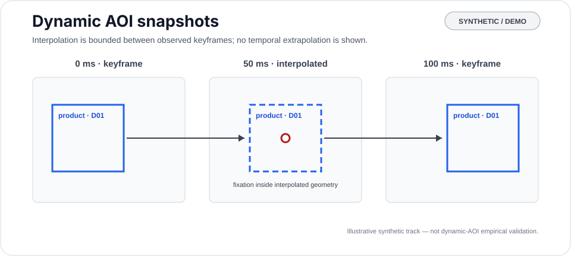
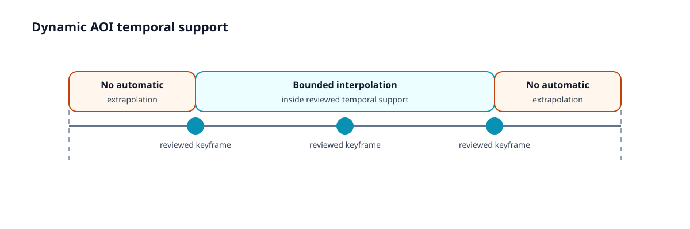
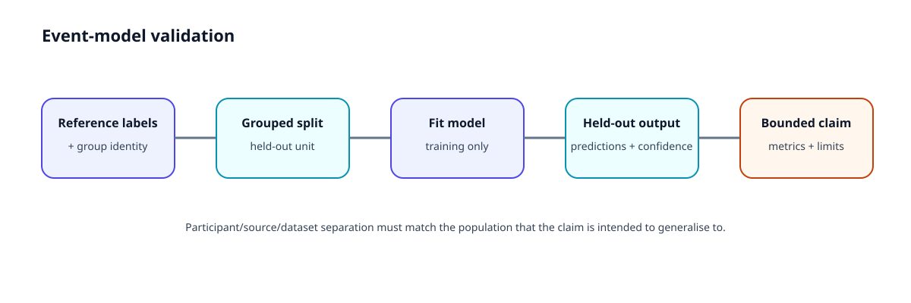
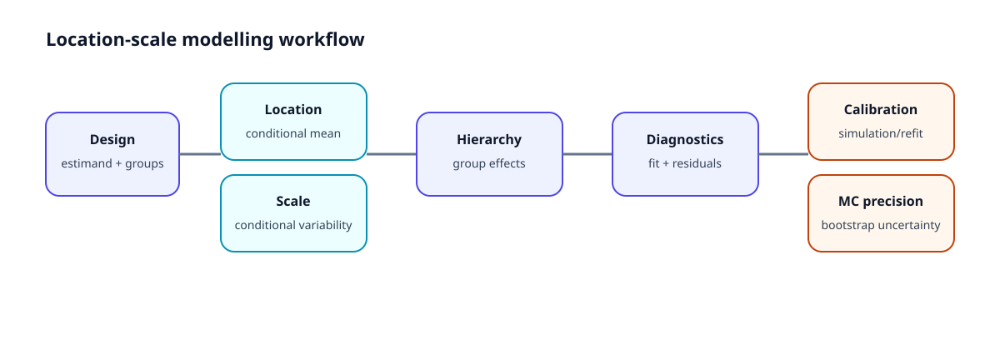

---
tags:
  - Visualization
  - Plots
  - Diagnostics
  - Validation
---

# Plot gallery

A scientific figure should make the **interpretation boundary** visible as well as the result.

## Research lifecycle

**Use for:** understanding where source preservation, QC, review, analysis, validation, and reporting sit.

**Do not infer:** that completing every stage establishes external or construct validity.

## QC diagnostics

**Use for:** identifying quality patterns requiring interpretation or review.

**Do not infer:** that a QC flag is automatically an exclusion.

## Event diagnostics

**Use for:** inspecting event segmentation behaviour.

**Do not infer:** that a visually plausible threshold is universally valid.

## AOI scanpath

**Use for:** communicating reviewed spatial or semantic sequence structure.

**Do not infer:** latent cognitive states from sequence geometry alone.

## Dynamic AOIs

**Use for:** distinguishing reviewed temporal support from bounded interpolation.

**Do not infer:** that extrapolated boxes outside reviewed support are validated AOIs.

## Validation design

**Use for:** explaining why grouping and held-out unit identity belong in the validation claim.

## Benchmark evidence

### Lund2013 derived-60 evidence

### Hollywood2EM derived-60 evidence

**Do not infer:** that derived-rate evidence is equivalent to native-device evidence.

## Location-scale modelling

Use with [hierarchical location-scale models](hierarchical-location-scale.md), [residual calibration](location-scale-residual-calibration.md), and [bootstrap Monte Carlo precision](location-scale-bootstrap-monte-carlo.md).
