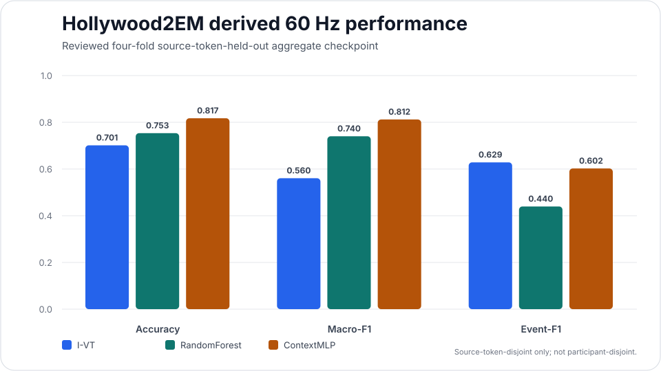

# Results gallery

This page is a visual orientation layer for GazeForge's current reviewed evidence. Every plot is paired with the table and evidence boundary that make the result scientifically interpretable.

!!! warning "Plots are summaries, not stronger evidence"
    A visual does not upgrade the validation design behind it. Derived lower-rate results remain derived; source-token-disjoint results remain source-token-disjoint; unresolved source/identity questions remain unresolved.

## Lund2013: participant-held-out derived 60 Hz checkpoint

<figure class="gf-figure-card">
  
  <figcaption>Primary RA-labelled derived-60-Hz checkpoint. Higher is better for all three displayed metrics.</figcaption>
</figure>

| Model | Balanced accuracy | Macro-F1 | Event-F1 |
| --- | ---: | ---: | ---: |
| **I-VT** | 0.388 | 0.287 | **0.626** |
| **RandomForest** | 0.670 | 0.595 | 0.440 |
| **ContextMLP** | **0.679** | **0.649** | 0.535 |

**Interpretation.** ContextMLP is strongest on the displayed sample-level multiclass metrics, while the transparent I-VT baseline has the highest event-F1. The result therefore does not support a blanket "AI beats I-VT" claim.

**Evidence boundary.** Lund2013 is a native 500 Hz corpus. The 60 Hz analysis is a controlled derivation from expert labels and does **not** establish native 60 Hz or GP3-specific event validity.

[Inspect the frozen Lund2013 evidence →](frozen-evidence.md)

## Hollywood2EM: reviewed source-token-held-out checkpoint

<figure class="gf-figure-card">
  
  <figcaption>Four-fold aggregate checkpoint over 16 opaque canonical source tokens.</figcaption>
</figure>

| Model | Accuracy | Macro-F1 | Event-F1 |
| --- | ---: | ---: | ---: |
| **I-VT** | 0.70149 | 0.56046 | **0.62856** |
| **RandomForest** | 0.75339 | 0.74038 | 0.43974 |
| **ContextMLP** | **0.81733** | **0.81194** | 0.60227 |

**Interpretation.** ContextMLP leads the displayed aggregate sample-level summaries, while I-VT again has the highest event-F1.

**Evidence boundary.** The four folds are disjoint by opaque source token, not by verified participant identity. The exact annotation-repository licence text/identifier and token→participant mapping remain unresolved. This checkpoint is therefore **not participant-disjoint**, not stimulus-held-out, and not Lund2013↔Hollywood2EM cross-dataset evidence.

Reviewed report fingerprint:

```text
a7a6219d6ffcb1fc6622110887a95f2c9d0646fea6e22d0ada941fe07b90586a
```

Frozen-summary fingerprint:

```text
e1f1c030f843e118ebd65520dfab8e872efb4ea3e1d520299a993b0ca00ddabf
```

[Read the Hollywood2EM benchmark boundary →](hollywood2-benchmark.md)

## What the two plots show together

<div class="grid cards" markdown>

-   :material-chart-multiple:{ .lg .middle } **Metric choice changes the headline**

    ---

    Sample-level multiclass performance and event segmentation are related but not interchangeable. The leading method can change when the estimand changes.

-   :material-account-lock-outline:{ .lg .middle } **Split provenance matters**

    ---

    Participant-disjoint and source-token-disjoint designs cannot be described with the same validation claim even when their metric tables look similar.

-   :material-timer-sand:{ .lg .middle } **Sampling provenance matters**

    ---

    A derived 60 Hz condition from a higher-rate corpus is useful sensitivity evidence, but it is not native 60 Hz tracker validation.

-   :material-fingerprint:{ .lg .middle } **Evidence should be replayable**

    ---

    Frozen reports and summaries carry deterministic fingerprints so the public interpretation can be traced back to an exact artifact.

</div>

## Where the next plots should come from

Future gallery additions should be generated only after the corresponding evidence is qualified. High-value candidates include:

- native 60 Hz / GP3 expert-labelled event performance;
- Gaze-in-the-Wild task-stratified performance once authoritative numeric task mapping is resolved;
- VISUS dynamic-AOI model-human and human-human agreement after source/reuse gates permit empirical execution;
- calibration and selective-coverage curves from qualified probabilistic event models;
- rate × boundary-purity sensitivity surfaces with retention shown alongside performance.

Until those gates are satisfied, the site should show the open evidence state rather than manufacture a visual placeholder that could be mistaken for a completed result.
